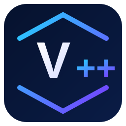

<div align="center">
  

# V++

### Ngôn ngữ lập trình tiếng Việt, có compiler, bytecode VM và toolchain riêng.

*Vietnamese-first programming language with its own compiler, bytecode VM and developer toolchain.*

Viết chương trình bằng cú pháp gần gũi với tiếng Việt, nhưng vẫn có những thành phần của một
ngôn ngữ thực tế: semantic analysis, IR, bytecode verifier, tracing GC, module/package system,
LSP, formatter, linter và bộ thư viện chuẩn.

[](https://github.com/winbiru/VXX/actions/workflows/c-cpp.yml)
[](https://github.com/winbiru/VXX/releases)
[](LICENSE)
[](CMakeLists.txt)

[🚀 Cài đặt](#-cài-v-trong-vài-phút) · [✨ Xem cú pháp](#-v-trông-như-thế-nào) · [🧰 Tooling](#-tooling-đi-kèm) · [🗺️ Roadmap](plans/roadmap-1.0.md) · [🤝 Đóng góp](CONTRIBUTING.md)
</div>

---

## V++ là gì?

V++ là một ngôn ngữ lập trình dynamic-typed được xây dựng từ đầu với **cú pháp tiếng Việt và
Unicode là công dân hạng nhất**.

Mục tiêu của dự án không chỉ là đổi keyword sang tiếng Việt. V++ đang xây dựng đầy đủ một stack:

```text
Mã nguồn V++
    ↓
Lexer → Parser → AST → Semantic Analysis
    ↓
Untyped IR → Optimizer → Bytecode
    ↓
Bytecode Verifier → V++ VM → Tracing GC
```

V++ phù hợp nếu bạn quan tâm tới compiler/VM, thiết kế ngôn ngữ, runtime, hoặc đơn giản muốn thử
một ngôn ngữ mà code tiếng Việt trông tự nhiên hơn.

## ✨ V++ trông như thế nào?

```vi
hàm chào(tên) {
    trả về "Xin chào, " + tên + "!";
};

hàm chính() {
    in chào("Việt Nam");

    lặp(i = 1; i <= 5; i++) {
        nếu (i % 2 == 0) {
            in "Số chẵn: " + i;
        };
    };
};
```

Class, kế thừa và interface cũng dùng cú pháp tiếng Việt:

```vi
giao diện CóTên {
    hàm tên();
}

lớp SảnPhẩm triển khai CóTên {
    hàm khởi tạo(tên) {
        mình.tênSảnPhẩm = tên;
    };

    hàm tên() {
        trả về mình.tênSảnPhẩm;
    };
}

hàm chính() {
    càPhê = SảnPhẩm("Cà phê Việt Nam");
    in càPhê.tên();
};
```

Xem đầy đủ tại [Language Reference](docs/language-reference.md).

## 🔥 Có gì đáng chú ý?

| Thành phần | V++ hiện có |
| --- | --- |
| Ngôn ngữ | Hàm, lambda/closure, list/map, exception, class, inheritance, interface, visibility |
| Compiler | Lexer, parser, semantic analysis, IR, optimizer, bytecode codegen |
| Runtime | Bytecode VM, verifier, stack trace, module lifecycle, tracing GC |
| Package | `vpp.json`, SemVer, deterministic `vpp.lock`, cache/offline, path/Git/registry package |
| Stdlib | Text/Unicode, collection, JSON, file/path, time, HTTP, SQL và nhiều module mở rộng |
| Tooling | Formatter, linter, AST/IR dump, REPL, LSP, VS Code integration |
| Platforms | Windows, macOS và Linux |

Một vài điểm V++ tập trung mạnh:

- **Tiếng Việt thật sự trong source**: identifier có dấu, `mình`, `gốc`, `nếu`, `lặp`, `thử`, `bắt lỗi`…
- **Không chỉ là transpiler**: V++ có bytecode format nội bộ và VM riêng.
- **Runtime có verifier + tracing GC**: bytecode được kiểm tra trước khi thực thi và object graph có cycle collection.
- **Compiler có IR thật**: frontend, semantic, IR và codegen được tách thành các tầng rõ ràng.
- **Package reproducible**: dependency được khóa bằng version + fingerprint trong `vpp.lock`.
- **Developer tooling đi cùng ngôn ngữ**: formatter, linter, REPL và LSP dùng chung semantic model.

## 🚀 Cài V++ trong vài phút

> V++ đang tiến tới mốc 1.0. Build metadata trên nhánh phát triển có thể đi trước release final;
> xem [Roadmap 1.0](plans/roadmap-1.0.md) để biết trạng thái release gate hiện tại.

### macOS

```bash
curl -L https://github.com/winbiru/VXX/releases/latest/download/vpp-macos.tar.gz -o vpp-macos.tar.gz
tar -xzf vpp-macos.tar.gz
./install-vpp.sh
```

### Linux x64

```bash
curl -L https://github.com/winbiru/VXX/releases/latest/download/vpp-linux-x64.tar.gz -o vpp-linux-x64.tar.gz
tar -xzf vpp-linux-x64.tar.gz
./install-vpp.sh
```

### Windows PowerShell

```powershell
Invoke-WebRequest -Uri "https://github.com/winbiru/VXX/releases/latest/download/vpp-windows-x64.zip" -OutFile "vpp-windows-x64.zip"
Expand-Archive -Path "vpp-windows-x64.zip" -DestinationPath ".\vpp-bin" -Force
.\vpp-bin\install-vpp.cmd
```

**Chỉ cần chạy installer một lần.** Installer tự cài binary, stdlib, templates/examples, cấu hình
`PATH`, `VPP_HOME` và UTF-8/locale cho shell phù hợp. Cài lại dùng cùng installer để cập nhật và
không nhân đôi block cấu hình. Sau khi cài, mở terminal mới và chạy:

```text
vpp phiên bản
vpp chẩn đoán
```

Trên Windows, installer ghi block có marker vào PowerShell `CurrentUserAllHosts` profile để các
PowerShell mở sau đó tự dùng code page 65001, UTF-8 input/output và `LANG=vi_VN.UTF-8`. Trên
macOS/Linux, installer ưu tiên `vi_VN.UTF-8`; nếu hệ thống chưa có locale này thì chọn một locale
UTF-8 đang tồn tại. Uninstaller chỉ xóa cấu hình do V++ quản lý.

Chi tiết cài đặt, cập nhật, gỡ cài đặt và troubleshooting nằm trong
[docs/installation.md](docs/installation.md).

## ⚡ Chạy chương trình đầu tiên

Tạo `xin-chao.vi`:

```vi
hàm chính() {
    in "Xin chào V++!";
    in "2 + 3 = " + (2 + 3);
};
```

Sau đó:

```bash
vpp chạy xin-chao.vi
```

Hoặc tạo hẳn một project:

```bash
vpp khởi tạo ứng dụng hello-vpp
cd hello-vpp
vpp dựng src/chính.vi
vpp chạy src/chính.vi
vpp kiểm thử tests
```

## 🧰 Tooling đi kèm

```bash
vpp chạy app.vi                 # chạy source
vpp dựng app.vi                 # chạy compiler pipeline
vpp kiểm thử tests              # chạy test project
vpp --soát-lỗi src/             # linter
vpp --định-dạng src/ --kiểm-tra # formatter check
vpp --dump-ast app.vi           # xem AST
vpp --dump-ir app.vi            # xem IR
vpp --giải-mã app.vi            # disassemble bytecode
vpp --repl                      # REPL
vpp --lsp                       # language server
vpp chẩn đoán                   # kiểm tra môi trường
```

CLI dùng tên tiếng Việt làm contract chính; các alias quen thuộc như `run`, `build`, `test`,
`new` vẫn được giữ để tương thích.

### VS Code

Repo có extension hỗ trợ `.vi` với syntax highlighting và LSP cho:

- diagnostic;
- completion;
- go-to-definition;
- hover;
- rename;
- format.

Cài extension local:

```bash
./scripts/vpp-lang self-install
vpp-lang install --editor vscode
```

Sau đó reload VS Code và mở file `.vi`.

## 📦 Package system

Project V++ dùng `vpp.json` và `vpp.lock`:

```bash
vpp gói cài đặt ./thu-vien-cua-toi
vpp gói cài đặt git+https://github.com/example/pkg.git#main
vpp gói cập nhật
vpp gói khóa
vpp gói phục hồi --ngoại-tuyến
```

Package manager hỗ trợ SemVer range, dependency transitive, deterministic lockfile, cache offline,
local path, Git source và filesystem registry.

Đọc thêm: [Package System](docs/package-system.md).

## 🧪 Build từ source

Yêu cầu chính: compiler C++17 và CMake.

```bash
git clone https://github.com/winbiru/VXX.git
cd VXX
cmake -S . -B build -DCMAKE_BUILD_TYPE=Release
cmake --build build --parallel
ctest --test-dir build --output-on-failure --no-tests=error
```

Binary nằm tại:

```text
build/bin/vpp-cli
```

Chạy trực tiếp:

```bash
./build/bin/vpp-cli chạy src/tests/program.vi
```

Windows có thể build bằng MSVC/CMake; hướng dẫn chi tiết nằm trong
[docs/installation.md](docs/installation.md).

## 🧠 Kiến trúc

V++ chia source C++ thành các module riêng:

```text
vpp-core
   ↓
vpp-bytecode
   ↓
vpp-frontend
   ↓
vpp-compiler ──→ vpp-tooling
   ↓
vpp-runtime
   ↓
vpp-cli
```

Các package viết bằng V++ nằm dưới `gói/`, còn native runtime chỉ giữ những primitive cần tương
tác với hệ điều hành hoặc host runtime.

Xem chi tiết: [Architecture](docs/architecture.md) · [Bytecode](docs/bytecode.md) ·
[Semantics](docs/semantics.md) · [Runtime Errors](docs/runtime-errors.md).

## 🗺️ Trạng thái 1.0

V++ đã có phần lớn nền tảng của 1.0: semantics, object model, compiler pipeline, VM, package system,
toolchain và documentation. Công việc còn lại tập trung vào hardening release:

- same-machine performance baseline/candidate regression gate;
- GC allocation/RSS/p95 telemetry;
- Linux ASan/UBSan/LSan evidence;
- artifact install smoke trên Windows/macOS/Linux;
- audit bề mặt stdlib stable trước final.

Theo dõi checklist đầy đủ tại [Roadmap V++ 1.0](plans/roadmap-1.0.md) và
[Quality Gates](docs/quality.md).

## 🧩 Ví dụ trong repo

- `examples/hoa-don-cua-hang` — module, class/constructor và import tương đối.
- `examples/quan-ly-kho-api` — sample backend/HTTP lớn hơn để kiểm tra package + runtime.
- `src/tests/` — regression corpus của compiler và VM.

## 🤝 Đóng góp

Compiler, runtime, stdlib, tooling và documentation đều có chỗ để đóng góp.

Nếu bạn muốn bắt đầu nhanh:

1. Fork repository.
2. Chọn một issue hoặc một mục trong [Roadmap](plans/roadmap-1.0.md).
3. Build và chạy CTest trước khi sửa.
4. Thêm regression khi thay đổi behavior.
5. Gửi pull request với mô tả rõ trước/sau.

Đọc [CONTRIBUTING.md](CONTRIBUTING.md) để biết quy ước chi tiết.

## ⭐ Nếu bạn thấy V++ thú vị

Hãy **Star** repo để theo dõi quá trình đưa một ngôn ngữ lập trình tiếng Việt từ compiler/VM thử
nghiệm tới mốc 1.0, hoặc chia sẻ V++ cho những người quan tâm tới compiler, VM và language design.

Ý tưởng, bug report và pull request đều được hoan nghênh.

## 📚 Tài liệu

- [Language Reference](docs/language-reference.md)
- [CLI](docs/cli.md)
- [Package System](docs/package-system.md)
- [Testing](docs/testing.md)
- [Installation](docs/installation.md)
- [Architecture](docs/architecture.md)
- [Debugging](docs/debugging.md)
- [Migration to 1.0](docs/migration-1.0.md)
- [Roadmap 1.0](plans/roadmap-1.0.md)
- [Changelog](CHANGELOG.md)

## License

V++ được phát hành theo giấy phép [MIT](LICENSE).
