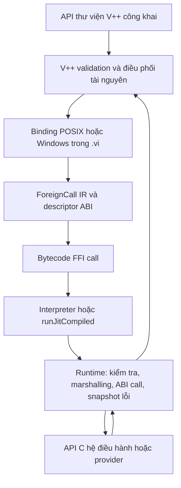

# Kế hoạch chuyển primitive hệ điều hành sang thư viện V++

**Cập nhật 2026-10-09 (Windows process):** API `chạy tiến trình` mặc định
dùng FFI trên POSIX lẫn Windows, dựng argv/quote, môi trường, multiplex,
deadline và kết quả tại `gói/hệ thống/tiến trình.vi`. Đã gỡ implementation
process legacy trong `vm_native_helpers.cpp`; opcode trực tiếp cũ không còn
được gọi trên Windows. `foreign.cpp` giữ Win32 ABI và vòng đời child/pipe.
Build và kiểm thử trên macOS không thay thế cho gate thực thi Windows;
CI Windows vẫn cần xác nhận trước khi đóng M7/M8.

Ngày khảo sát: **2026-10-08**. Trạng thái: **MVP FFI POSIX đã hoạt động; migration System còn dở**.
Các phần dưới đây mô tả kiến trúc đích và gate chưa hoàn thành; những thành phần đã
triển khai được phân biệt ở bảng tiến độ ngay sau đây. Không suy ra tính năng đã chạy
chỉ từ ví dụ mã hoặc thiết kế trong tài liệu.
Hiện trạng đã có được ghi riêng tại [audit native](native-boundary-audit.md),
[kiến trúc](architecture.md) và [bytecode](bytecode.md).

**Nguyên tắc migration (2026-10-09):** giữ đủ hành vi và API công khai trước
khi loại bỏ helper C++. Mỗi bước phải có (1) thuật toán thay thế trong `.vi`,
(2) primitive hệ điều hành FFI nhỏ có kiểm tra capability/ABI, (3) regression
interpreter/JIT và Windows/POSIX phù hợp, (4) chuyển mặc định, rồi mới (5) gỡ
helper C++ không còn caller. Native provider/handle/ABI vẫn là phần bắt buộc
của VM; không xóa tính năng chỉ vì còn dùng C++.

**Windows directory FFI thử nghiệm:** `gói/nhập xuất/thư mục.vi` đã điều phối
tạo nhiều cấp, liệt kê, xóa cây bằng V++. Các binding `system.fs.mkdir/remove`
dùng Win32 `CreateDirectoryW`/`RemoveDirectoryW`/`DeleteFileW` và
`system.fs.dir.open/read/close` dùng `FindFirstFileW`/`FindNextFileW`/`FindClose`
với token VM được giải phóng khi đóng hoặc reset. Mặc định Windows vẫn giữ
primitive tạo/xóa/liệt kê cũ; `VPP_WINDOWS_DIRECTORY_FFI=1` chuyển ba thao tác
sang FFI mà không đổi API V++. `scripts/windows/run-tests.ps1` chạy fixture
thư mục cả đường cũ và opt-in, interpreter/JIT. Đã thêm adapter chỉ đọc
`system.fs.path.kind` gọi `CreateFileW`/`GetFileInformationByHandle`: trả
`-1` nếu đường thiếu, `0` loại khác/reparse point không theo liên kết,
`1` tệp, `2` thư mục. V++ quyết định phép `tồn tại`, `là tệp`, `là thư mục`
và nhận biết thư mục không theo liên kết khi bật `VPP_WINDOWS_DIRECTORY_FFI=1`
hoặc `VPP_WINDOWS_PATH_FFI=1`. Adapter kiểm tra chặt ký hiệu, capability,
ABI và cờ follow (0/1); chưa gỡ opcode cũ trước khi Windows parity đạt.
**Chưa chạy Windows CI với
thay đổi này**; không được gỡ helper cũ hay bật FFI mặc định trước khi parity
trên Windows đã đạt. Riêng process Windows đã chuyển sang FFI mặc định,
không còn cần cờ `VPP_WINDOWS_PROCESS_FFI`; fixture dùng `cmd.exe` thay `/bin/sh`.

### Tiến độ thực tế (2026-10-09)

| Thành phần | Đã chạy | Chưa hoàn thành |
| --- | --- | --- |
| Frontend/compiler | `ngoại thư viện`, `ngoại hàm`, `ForeignCall` IR, phát `OP_FFI_CALL = 156`; kiểm tra alias, kiểu, arity, ABI và capability; khai báo `c_đệm_ra[16]`/`c_đệm_vào[số_byte]` và giữ metadata extent đến descriptor | Ownership/layout và target profile đầy đủ; quan hệ pointer tổng quát |
| Runtime POSIX | `libffi` + `dlsym`/`dlopen`, scalar `i32/u32/i64/u64/f64`, `c_chuỗi` và `void`, capability + verifier đối chiếu argc, descriptor, extent; số ABI boxed và số học nguyên chính xác; `errno` riêng từng VM; `c_đệm_ra`/`c_đệm_vào` theo contract từng API; token `FILE*`/`DIR*`/resolver riêng VM; binding cho env/process identity, clock/getentropy, stdio, `mkdir`/`remove`/`access`, `stat`/`lstat`, `opendir`/`readdir`/`closedir`, `localtime_r`; adapter `getaddrinfo`/`getnameinfo` và cleanup resolver; layout guard theo SDK | Constructor/literal `AbiInteger`, pointer/handle/buffer relation tổng quát, error domain khác POSIX, caching và ABI Windows |
| System public | POSIX dùng FFI cho env, PID/PPID, UID/GID, sleep/EINTR, monotonic/realtime/local clock và DST, entropy, tồn tại/phân loại tệp/thư mục, liệt kê, tạo/xóa đường dẫn, DNS và phân giải địa chỉ kết nối; năm API đọc/ghi/ghi nối tệp điều phối chunk/EOF/partial write/close từ V++ qua stdio; TCP/UDP và TLS client qua binding theo capability/token VM, trong đó TLS handshake và mật mã chạy qua adapter provider đã kiểm chứng; `chạy tiến trình` dựng argv/env, multiplex hai pipe và dọn dẹp trong V++ qua FFI cả POSIX/Windows | Provider TLS POSIX vẫn là native (SecureTransport/OpenSSL), chưa có integration xác minh server/chứng chỉ với fixture TLS độc lập; worker/scheduler và Windows process FFI còn cần xác nhận trên Windows, Windows TLS vẫn native; spawn POSIX và Win32 vẫn cần adapter C++ cho ABI/OS; chưa có CI đa nền tảng |
| Đa nền tảng | macOS POSIX chạy thực tế; Windows đã có FFI adapter cho env, sleep, file, clock, entropy, process và thư mục (opt-in nơi chưa chứng minh parity); CMake yêu cầu `libffi`/pkg-config trên POSIX | Windows FFI chưa được kiểm chứng đầy đủ bằng CI; DNS/socket/TLS và một số metadata vẫn dùng fallback; Linux và toàn bộ matrix ABI chưa được chứng minh cho tới khi runner thực thi thành công |

Kiểm thử: `src/tests/kiem_tra_ffi_moi_truong.vi` (fixture biến môi trường
deterministic qua `run_tests.sh`), `src/tests/kiem_tra_ffi_tien_trinh.vi`
(PID dương, giữ nguyên trong tiến trình, đúng kiểu),
`src/tests/kiem_tra_ffi_ngu.vi` (0 ms, 2 ms, 1001 ms và đối số lỗi),
`vpp-runtime-p0-hardening` (quyền riêng cho `getpid`/`getppid`, symbol, chữ
ký ABI, interpreter/JIT),
và `vpp-rc-internal-hardening`
(IR/verifier, lời gọi hàm tên nhiều từ bắt đầu bằng keyword ngữ cảnh,
`i64/u64` từ source đến descriptor/IR/bytecode). Runtime fixture export
`vpp_ffi_test_i64`/`vpp_ffi_test_u64`/`vpp_ffi_test_u32` để kiểm tra
roundtrip biên `INT64_MIN`/`INT64_MAX`/`UINT64_MAX`/`UINT32_MAX` thực tế và
từ chối làm tròn sang `f64`.
Build macOS và CTest đầy đủ ngày 2026-10-08 đạt **4/4 PASS**, gồm ca tích hợp
`kiem_tra_ffi_ngu.vi` chạy `0`, `2` và `1001` mili giây, cùng kiểm thử
`kiem_tra_ffi_tien_trinh.vi` đọc PID cha trên POSIX. Bộ CTest đã chạy lại
sau khi thêm `system.process.parent_id`: **4/4 PASS**.

UTC trên POSIX và Windows đã chuyển qua FFI realtime với quyền
`system.time.realtime` riêng; runtime giới hạn `c_đệm_ra` vào hai binding
clock đã kiểm chứng, khóa clock ID và wire format 16 byte (Windows dùng
`GetSystemTimeAsFileTime` trong adapter). V++ giải
mã `tv_sec` có dấu, đổi epoch thành Gregorian proleptic năm 0000..9999,
và trả ISO-8601. `kiem_tra_ffi_utc.vi` kiểm thử mốc âm, năm nhuận, 2038,
biên thời gian và lời gọi clock thực. Local clock trên POSIX dùng cùng
snapshot epoch qua `localtime_r(c_đệm_vào,c_đệm_ra):c_cờ_con_trỏ` quyền
`system.time.local`. Runtime xác nhận layout `struct tm`/LP64/little-endian,
không lộ pointer native và không chép đệm khi lời gọi thất bại. V++ giải mã
ngày giờ/offset và dựng ISO-8601. Test DST cố định dùng quy tắc
`TZ=EST5EDT,M3.2.0/2,M11.1.0/2`, kiểm chứng hai bước chuyển mùa và epoch âm
trên interpreter/JIT fallback. Windows dùng adapter `_localtime64_s` để nhận
các trường lịch 64 byte, rồi V++ tính offset từ lịch local và epoch UTC của cùng
một snapshot, kể cả thời điểm đổi DST. `dong_ho_dia_phuong_vm` đã bị chặn
trên cả hai OS và implementation C++ cũ đã được gỡ. UTC cũng gọi FFI.
Windows interpreter/JIT và các opcode giờ cũ vẫn chờ chạy CI thực tế.

`ngủ mili giây()` tách thời lượng dương thành các đợt tối đa 999 ms trước khi
gọi POSIX `usleep`, tránh tràn số nguyên V++ khi chuyển sang micro giây.
Wrapper đã có vòng thử lại khi lời gọi bị ngắt: tính thời lượng chưa ngủ theo
đồng hồ đơn điệu (`thời gian đơn điệu mili giây()` trong V++, gọi
`clock_gettime` qua FFI trên POSIX) thay vì ngủ lại toàn bộ đợt;
giới hạn 128 lần gọi lỗi/đợt. Runtime đã chụp `errno` ngay sau lời gọi POSIX,
lưu riêng theo VM và cung cấp binding `last_errno()`/`eintr()` có capability
`system.ffi.error`. Wrapper chỉ thử lại khi `usleep` trả -1 và `errno == EINTR`,
ngược lại ném lỗi. Runtime hardening kiểm chứng `close(-1)` tạo `EBADF`,
truy vấn EINTR không ghi đè snapshot, `getpid` xóa lỗi cũ, và trạng thái VM
độc lập/reset đúng trên interpreter và JIT fallback. Chưa có fixture bơm tín hiệu
ngắt `usleep` theo cách ổn định. Windows FFI ánh xạ `usleep` vào `Sleep`, và
`clock_gettime` đơn điệu vào `QueryPerformanceCounter`; phần chia đợt,
deadline và tính mili giây đều ở V++. Opcode sleep/monotonic legacy đã gỡ
handler C++ và bị chặn trên cả POSIX/Windows. Cần chạy gate CI Windows thực tế.

`last_errno()` trả snapshot thô của native call gần nhất trong cùng VM. Theo
POSIX, giá trị `errno` sau một native call thành công không nhất thiết là 0;
chỉ giải nghĩa nó khi contract API báo thất bại. Integration test kiểm tra
`eintr()` không thay đổi snapshot và khai báo `ngoại hàm` đi qua compiler/VM.

Entropy bảo mật dùng `system.entropy.read`: POSIX gọi `getentropy`, Windows
gọi `BCryptGenRandom`; V++ chia đệm dài thành các lời gọi 1–256 byte và trả
danh sách byte. Linux vẫn chờ kiểm thử libc/ABI trên runner thật.
`gói/nhập xuất/thư mục.vi` dùng
`mkdir(c_chuỗi,u32)` quyền `system.fs.mkdir`, mode duy nhất 0777 chịu `umask`,
và `remove(c_chuỗi)` quyền `system.fs.remove`; hai quyền khóa symbol và chữ ký.
V++ giữ traversal không đệ quy, xử lý EEXIST/ENOENT, UTF-8 và NUL của đường dẫn;
Windows mặc định còn `tao_thu_muc_vm`/`xoa_duong_dan_vm`, nhưng có adapter
Win32 FFI để kiểm thử và chuyển hẳn sau khi đạt parity trên CI. Truy vấn tồn tại dùng
`access(c_chuỗi, F_OK=0)` trên POSIX (`system.fs.exists`), **theo** symlink;
symlink đứt có kết quả không tồn tại. Phân loại `stat`/`lstat` dùng đệm 256 byte
và `stat_mode_offset()` xác nhận theo SDK host, với capability độc lập.
Liệt kê qua `opendir/readdir/closedir`, token `DIR*` được VM sở hữu/cleanup;
V++ lọc `.`/`..`, sắp xếp, duyệt và xóa cây không theo symlink. Test ABI,
symlink đứt, handle sai VM/đã đóng và cleanup đã có trên macOS. Windows vẫn
dùng primitive cũ nên chưa thể gỡ helper filesystem.

File POSIX/Windows dùng năm binding stdio (`system.file.open/read/write/close/error`),
`c_đệm_vào`/`c_đệm_ra` kiểm tra từng byte và giới hạn độ dài, `c_tệp` không
lộ `FILE*` mà dùng token VM cấp và xác nhận sở hữu; ID tăng toàn cục để token
đã đóng không thể hợp lệ lại ở VM khác. VM đóng các file còn mở khi hủy/reset.
`gói/nhập xuất/tệp.vi` điều phối chunk 4096 byte, phân biệt EOF/lỗi, partial
write, append và dọn dẹp trên nhánh lỗi. Gate strict POSIX
`VPP_STRICT_SYSTEM_FFI_FILE=1` kiểm tra các public API FFI vẫn chạy còn opcode
file legacy bị từ chối ở cả POSIX và Windows; Windows dùng `_wfopen`/`fread`/
`fwrite`/`fclose`/`ferror` qua System FFI, giữ chu trình chunk và cleanup ở V++.

Resolver POSIX `system.net` dùng `resolve_open(c_chuỗi,c_chuỗi,i32):c_dns`,
`resolve_next(c_dns):c_chuỗi` và `resolve_close(c_dns):i32`. Runtime giữ
`addrinfo*` trong token riêng VM, chỉ trả địa chỉ số IPv4/IPv6, bảo toàn thứ tự
để V++ thử lần lượt khi kết nối. Đường DNS công khai vẫn sort/dedup trong V++;
token được đóng cả khi hết kết quả hoặc có lỗi. Adapter này cần thiết vì ABI
`addrinfo**`/`sockaddr` chưa được biểu diễn tổng quát; không tuyên bố là
`libffi` hỗ trợ cấu trúc đó. Runtime hardening kiểm tra quyền, chữ ký, input
lỗi, token giả/đã đóng/khác VM, IPv4/IPv6, EOF và cleanup. Test
`kiem_tra_ffi_dns.vi` chạy trong gate `VPP_STRICT_SYSTEM_FFI_POSIX=1`.

Socket TCP/UDP POSIX đã có adapter `socket_connect/listen/accept/timeout/kind`
và `send/recv/close` qua FFI. Mỗi socket nhận token không trùng giữa các VM;
backend kiểm tra token, chiều/extent đệm, cờ send/recv và giới hạn datagram;
V++ giữ vòng partial-send, timeout sau connect/accept và quy tắc một datagram.
Strict POSIX chặn opcode socket cũ, kiểm thử negative cho cả interpreter/JIT;
`kiem_tra_ffi_socket.vi` chạy TCP/UDP qua localhost khi runner cho phép bind.
HTTP fixture chạy với strict gate để kiểm tra cả `listen/accept/recv/send` của
server, độc lập với fixture socket client; nơi cấm bind được ghi rõ là skip.
TLS client công khai trên POSIX mở TCP bằng cùng FFI, sau đó gọi
`system.net.tls.upgrade/send/recv` qua adapter sở hữu phiên theo token VM.
Runtime xác nhận stream TCP đã kết nối, chuyển quyền đóng descriptor cho
provider và không cho dùng `send/recv` thô trên socket đã nâng cấp. Provider
SecureTransport (macOS) hoặc OpenSSL (Linux) vẫn thực hiện handshake, kiểm tra
chuỗi chứng chỉ/tên máy và mã hóa; V++ giữ vòng gửi hết, đọc byte nhị phân và
đóng socket. Khi handshake thất bại, token và fd bị thu hồi. Strict POSIX
chặn cả opcode `socket_tls_nang_cap_vm` cũ. Runtime hardening đã thử chữ ký,
capability, buffer extent, token khác VM, hostname sai, UDP/listener, cấm
plaintext I/O và cleanup sau handshake lỗi. Cần bổ sung end-to-end TLS với
fixture chứng chỉ/hostname và CI Linux trước khi đóng gate TLS.

Process POSIX đã chuyển đường public `gói/hệ thống/tiến trình.vi` sang chín
binding `system.process.new/arg/env/start/poll/read/wait/error/close`.
V++ tự tạo argv, ghi đè môi trường chỉ cho child, đọc xen kẽ hai pipe bằng
readiness và ghép byte nhị phân (kể cả NUL), đợi exit status rồi đóng token.
Tham số tùy chọn thứ tư `giới_hạn_mili_giây` đặt deadline bằng đồng hồ đơn điệu
POSIX; khi hết hạn, V++ đóng token, runtime SIGKILL/reap child và trả map
`khởi chạy=đúng`, `mã thoát=-1`, output đã đọc và thông báo quá thời hạn.
Trên Windows, `close` giải phóng Job Object với cờ `KILL_ON_JOB_CLOSE`, hủy
cả cây tiến trình khi hết deadline; vẫn cần runner Windows xác nhận timeout.
Runtime giữ token theo VM, từ chối gọi sai capability/chữ ký, token giả hoặc
của VM khác, thay argv/env sau start và khởi chạy lần hai; VM reset sẽ giết
và reap child chưa kết thúc. Adapter C++ vẫn cần thiết để dựng `argv**`/`envp**`,
file actions của `posix_spawnp` và quản lý descriptor POSIX khi generic FFI
chưa biểu diễn các cấu trúc đó. Strict POSIX cấm `tien_trinh_chay_vm`, còn
Windows process dùng FFI như POSIX. Fixture `kiem_tra_ffi_process_spawn.vi`
kiểm tra nonzero exit, stdout/stderr, argv literal, env riêng child, binary,
spawn thất bại, timeout/cancel và hai pipe mỗi pipe 73728 byte trên interpreter/JIT.

## 1. Mục tiêu và ranh giới thực tế

Đưa phần triển khai thư viện ra khỏi C++: V++ tự mở tài nguyên, điều phối đọc/ghi,
xử lý kết quả, retry, timeout, đóng tài nguyên và dựng giá trị public. VM cung cấp
một cơ chế gọi ABI dùng chung để thư viện `.vi` gọi API hệ điều hành hoặc thư viện C.
Sau migration, thêm API OS có ABI đã được hỗ trợ chỉ cần khai báo binding và viết V++.

Mã V++ chạy trong VM vẫn cần một đường ra hệ điều hành. FFI chuyển **quyền điều phối
lời gọi** sang V++; kernel, loader và hàm C được gọi vẫn thực thi bằng mã native.
Viết lại tên wrapper trong `.vi` nhưng tiếp tục gọi helper C++ xử lý trọn thao tác
không đạt mục tiêu này. Bỏ toàn bộ mã native đòi hỏi compiler sinh mã máy,
startup/runtime và ABI backend khác; việc đó vượt khỏi migration thư viện này.

Phần C++ tối thiểu còn lại gồm loader/symbol resolution, ABI trampoline, chuyển
biểu diễn giá trị, buffer/handle lifetime, GC roots, call frames và điều phối worker.
Không chuyển collection representation hoặc compiler service sang FFI tùy ý chỉ để
giảm số intrinsic. Các thuật toán collection, Unicode, regex, JSON, HTTP và formatter
đã ở V++ tiếp tục gọi instruction ngôn ngữ và primitive biểu diễn cần thiết.

Ưu tiên FFI tới API C của nền tảng. Một opcode `syscall` tổng quát không thay thế được
ABI đa nền tảng: số syscall, cấu trúc, quy ước lỗi và dịch vụ hệ thống khác nhau.
Backend syscall riêng, nếu cần, là công việc độc lập sau khi có benchmark và contract.

## 2. Hiện trạng và khoảng trống

Registry tại `src/include/vpp/bytecode/intrinsic.h` có **51 descriptor**.
Compiler hạ lời gọi thành `IrValueOpcode::Intrinsic`, rồi phát `OP_VM_*`; runtime
đi qua `VM::executeIntrinsicOpcode()` và `VM::dispatchRegisteredIntrinsic()`.
Tên cũ `executeVmIntrinsicFunction` trong trao đổi trước tương ứng với công việc cần
rà ở `executeVmPrimitive()` và các handler hiện hành, không còn là entrypoint cần sửa.

| Thành phần | Hiện có | Cần thêm cho migration |
| --- | --- | --- |
| Frontend | AST, import, function/call và source span | Khai báo foreign có signature ABI, metadata nền tảng, ownership |
| Semantic | Name/scope/visibility/arity; giá trị động | Bind foreign symbol theo ExprId, kiểm tra signature/capability |
| IR | IR không kiểu, `Call`, `CallDynamic`, `Intrinsic` | Foreign descriptor và `ForeignCall`; effect/lifetime metadata |
| Bytecode | `Instruction` trong bộ nhớ, opcode registry/verifier | Descriptor table FFI, call instruction, kiểm tra tham chiếu |
| Giá trị VM | `int`, `double`, string, handle collection/object và `AbiInteger` 64-bit boxed | Constructor và arithmetic boxed ở cấp ngôn ngữ, buffer, foreign handle có provenance |
| Runtime | Handler file/OS/socket/process chuyên biệt | Loader + marshaller + shared ABI call backend |
| JIT | Closure theo opcode, dispatcher chung cho lệnh phức tạp | Call boundary FFI, root/unwind/cache như interpreter |
| Thư viện | `.vi` giữ phần lớn validation/policy/algorithm | Binding OS và vòng đọc/ghi/điều phối ở `.vi` |
| Tooling | AST/IR dump, disassembler, audit stdlib | Dump descriptor/effect và phát hiện đường native cũ còn được gọi |

`VM::runJitCompiled()` hiện chưa tạo mã máy native. FFI phải chạy đúng trong cả
interpreter và đường closure hỗn hợp; thêm tính năng chỉ vào JIT sẽ làm thư viện
không hoạt động ở chế độ còn lại. Không công bố tăng tốc trước khi đo benchmark.

Bytecode hiện truyền bằng `std::vector<Instruction>`. FFI metadata cần chuyển
cùng bytecode trong bộ nhớ, **không cần đợi serializer `.vbc`**. Compatibility tuân
theo [ADR 0002](adr/0002-compatibility-policy-1.0.md).

## 3. Danh mục 51 intrinsic và đích đến

Bảng liệt kê đầy đủ tên canonical trong registry tại thời điểm khảo sát.
31 primitive OS là ứng viên chuyển sang binding; 20 primitive còn lại thuộc VM,
compiler và worker. Đây là baseline đối chiếu, không phải số helper có thể
xóa ngay: một helper có thể phục vụ nhiều opcode và nhiều caller ngoài stdlib.

| Nhóm / số lượng | Tên canonical | Đích triển khai |
| --- | --- | --- |
| File / 5 | `io_doc_file_vm`, `io_doc_bytes_vm`, `io_ghi_file_vm`, `io_ghi_bytes_vm`, `io_ghi_tiep_file_vm` | V++ điều phối open/read/write/close, giữ contract text/binary/append |
| Filesystem / 7 | `duong_dan_ton_tai_vm`, `la_tep_vm`, `la_thu_muc_vm`, `la_thu_muc_khong_theo_lien_ket_vm`, `liet_ke_thu_muc_vm`, `tao_thu_muc_vm`, `xoa_duong_dan_vm` | Binding stat/lstat/directory/mkdir/remove theo nền tảng; traversal ở V++ |
| Môi trường, nền tảng / 2 | `doc_bien_moi_truong_vm`, `ten_nen_tang_vm` | V++ sao chép env từ ABI; platform identity lấy từ target metadata VM |
| Clock / 4 | `dong_ho_dia_phuong_vm`, `dong_ho_utc_vm`, `thoi_gian_don_dieu_ms_vm`, `ngu_mili_giay_vm` | Local/UTC/monotonic/sleep đều dùng V++/FFI POSIX/Windows; Windows local adapter dùng `_localtime64_s`, tính offset ở V++; kiểm thử EINTR deterministic và CI Windows vẫn cần bổ sung |
| Entropy / 1 | `ngau_nhien_bao_mat_bytes_vm` | Binding nguồn entropy đã kiểm chứng, V++ kiểm tra độ dài và trạng thái |
| Network / 11 | `dns_phan_giai_vm`, `socket_chap_nhan_vm`, `socket_dat_timeout_vm`, `socket_dong_vm`, `socket_gui_vm`, `socket_nhan_vm`, `socket_phan_giai_vm`, `socket_tcp_lang_nghe_vm`, `socket_tcp_mo_vm`, `socket_tls_nang_cap_vm`, `socket_udp_mo_vm` | V++ resolver/connect/accept/send/recv, TLS orchestration qua provider ABI |
| Process / 1 | `tien_trinh_chay_vm` | V++ argv/env/pipe/spawn/wait; cần scheduler đủ để tránh deadlock |
| Worker / 5 | `thread_vm_spawn`, `thread_vm_wait`, `thread_vm_cancel`, `thread_vm_status`, `thread_vm_park` | Giữ VM lifecycle; chuyển policy sang `.vi`, không gọi closure V++ từ thread OS tùy ý |
| Biểu diễn VM / 13 | `bộ`, `loai_cua`, `bam_dinh_danh`, `do_dai`, `them`, `xoa_tai`, `co_khoa`, `xoa_khoa`, `khoa_map`, `chuoi_bytes_vm`, `chuoi_tu_bytes_vm`, `so_thuc_bits_vm`, `so_thuc_tu_bits_vm` | Giữ primitive representation; thuật toán dùng chúng nằm ở V++ |
| Compiler/VM / 2 | `bien_dich_phan_tich_vm`, `kich_ban_chay_vm` | Giữ service boundary; validation và diễn giải snapshot ở V++ |

Trước mỗi nhóm migration, lưu inventory theo hàm: file `.vi`, public API, primitive
đang gọi, helper C++ tương ứng, caller khác, lỗi/side effect và test hiện có. Audit
đếm lời gọi trực tiếp không chứng minh toàn bộ call graph và semantics; kiểm tra
import/re-export, alias, dynamic calls và các caller CLI/tooling.

Các điểm C++ phải rà khi chuyển nhóm:

| Tệp hiện có | Phần cần chuyển hoặc giữ |
| --- | --- |
| `src/runtime/vm.cpp` | Đã gỡ `executeNativeFilePrimitive` trên cả hai hệ điều hành; năm API file đọc/ghi điều phối hoàn toàn trong `.vi` qua stdio FFI, các opcode file cũ bị từ chối cả POSIX và Windows. `executeVmPrimitive` và dispatch vẫn giữ các nhóm chưa chuyển; worker lifecycle giữ trong VM. |
| `src/runtime/native/vm_native_stdlib_helpers.cpp` | Filesystem, clock, env, entropy legacy đã gỡ khỏi build POSIX; giữ đường Windows dự phòng và tag/identity của VM. |
| `src/runtime/native/vm_native_m3_helpers.cpp` | Resolver và TCP/UDP/TLS orchestration legacy đã gỡ khỏi build POSIX; giữ đường Windows dự phòng và provider TLS native cần cho FFI. |
| `src/runtime/native/vm_native_helpers.cpp` | Đã gỡ `handleNativeProcessPrimitive` cùng spawn/pipe/wait cũ trên mọi OS. V++ `chạy tiến trình` dùng adapter `system.process.*` trong `foreign.cpp` cho POSIX/Windows; Windows chưa được xác nhận bằng CI. |
| `src/runtime/native/vm_native_collection_helpers.cpp` | Giữ thao tác representation; rà để thuật toán collection mới không được thêm vào native. |
| `src/runtime/native/vm_native_compiler_helpers.cpp` | Giữ compiler analysis/embedded VM service và ABI nội bộ; thư viện diễn giải kết quả ở V++. |
| `src/include/common/vm_native_*helpers.h`, `src/include/common/vm_native_constants.h` | Rà declaration/constants/caller cùng lúc xóa implementation; chỉ gỡ phần không còn dùng. |

Mỗi nhóm cần tìm caller bằng tên handler, tên helper con và opcode, không chỉ tên
API public. Di chuyển helper sang tệp C++ khác không được tính là migration sang V++.

## 4. Kiến trúc đích và lựa chọn backend



MVP đề xuất backend ABI dùng **libffi**, sau spike xác nhận các target thực sự build
được. `ffi_prep_cif` chuẩn bị signature và `ffi_call` dùng signature thực hiện lời
gọi; xem [tài liệu chính thức libffi](https://github.com/libffi/libffi/blob/master/doc/libffi.texi).
Cache call interface theo descriptor/target ABI. Không ép mọi symbol về một function
pointer có signature chung rồi gọi: cách đó không bảo đảm calling convention.

Repo hiện khai báo CMake `LANGUAGES CXX`. Provider fixture có thể là `.cpp` export
`extern "C"`; nếu dùng fixture `.c`, phải bật C trong CMake và test toolchain tương ứng.
Đừng thêm fixture C mà mặc định cho rằng build hiện tại đã bật compiler C.

Nếu target chưa hỗ trợ dependency này, giữ backend cũ cho target đó và ghi limitation.
Không thay bằng adapter C++ theo từng API rồi tuyên bố đã hoàn tất FFI. Adapter sinh
tự động từ signature C là phương án khác cần ADR, đặc biệt cho static linking.

Loader POSIX dùng `dlopen`/`dlsym` và kiểm tra lỗi loader riêng; không suy luận lỗi
chỉ từ địa chỉ NULL. [Đặc tả dlsym](https://pubs.opengroup.org/onlinepubs/009604299/functions/dlsym.html)
mô tả symbol lookup qua object được loader cung cấp. Windows dùng
`LoadLibraryExW`/`GetProcAddress`, đường dẫn và dependency search có quy tắc tường minh;
xem [runtime linking](https://learn.microsoft.com/en-us/windows/win32/dlls/run-time-dynamic-linking)
và [quy tắc tìm DLL](https://learn.microsoft.com/en-us/windows/desktop/dlls/dynamic-link-library-security).

Logical library ID như `system.c`, `system.win32`, `tls.provider` được ánh xạ bởi
target profile tới provider thật. Không hard-code một tên `libc.so` cho macOS/Linux,
không giả định mọi hàm hiện link static đều có symbol tải động. Framework
macOS, Windows DLL và Linux package cần manifest riêng. Loader không tìm provider
trong cwd ngầm định; fixture dùng đường dẫn build tường minh.

## 5. Contract FFI phải chốt trước khi viết thư viện OS

### 5.1. Descriptor và signature

Descriptor immutable chứa: logical library, symbol bytes, calling convention,
argument/return ABI types, target constraint, nullable/direction/length relation,
ownership/release function, error policy, blocking policy, capability và source span.
Descriptor dùng ID trong chương trình; địa chỉ symbol chỉ resolve ở runtime.

MVP hỗ trợ fixed arity, C ABI phù hợp target, scalar, pointer tới managed buffer,
opaque handle và out parameter. Từ chối varargs, C++ mangled ABI, union/bitfield,
packed struct, aggregate truyền/trả by-value và callback chưa có backend đúng.
Windows 32 bit phải có calling convention được backend hỗ trợ; không tự coi
`cdecl`/`stdcall` là tương đương. Target chưa kiểm thử phải báo unsupported.

Semantic xác nhận declaration và lời gọi khớp metadata. Nó không xác minh được
signature thật chỉ từ symbol address; binding sai vẫn có thể gây crash native.
Binding stdlib phải đối chiếu với header/SDK target và ABI fixture.

### 5.2. Số nguyên, số thực và pointer width

| ABI type đề xuất | Representation và quy tắc |
| --- | --- |
| `i8/u8/i16/u16/i32/u32` | `i32/u32` đã hỗ trợ; `u32` vượt `INT32_MAX` dùng số ABI boxed; các width 8/16 bit chưa triển khai |
| `i64/u64` | Giá trị boxed chính xác, không chuyển qua `double` |
| `size_t/ssize_t/intptr_t/uintptr_t` | Kích thước/signedness từ target profile, không lấy từ số nguyên V++ hiện tại |
| `f32/f64` | Marshall IEEE-754; chốt round/narrowing và giữ NaN/±0 theo contract |
| `pointer/handle` | Opaque value có provenance; không lưu địa chỉ vào `int` hay `double` |
| `void` | Return V++ là `rỗng`; out values đọc từ buffer đã khai báo |

`StackValue` đã có `AbiInteger` để giữ nguyên signedness và toàn miền `i64/u64`.
FFI hiện cho phép truyền `int32`, chuỗi số thập phân hợp lệ hoặc giá trị boxed
nhận từ FFI cho `i64/u64` và `u32`; `u32` trả `int32` nếu nằm trong miền tương
thích, ngoài miền đó trả boxed. Giá trị boxed có so sánh, equality, truthiness, hiển thị và clone
giữa luồng. Chuyển boxed sang `f64` từ chối giá trị ngoài miền nguyên chính xác
`[-2^53, 2^53]`. Phép cộng/trừ/nhân/chia nguyên/chia lấy dư đã hỗ trợ với
kiểm tra tràn, chia 0 và trộn signed/unsigned; vẫn chưa có literal/constructor
`i64/u64` công khai. Các phép toán mở rộng, buffer,
GC/ownership native và type interop đầy đủ còn nằm trong các gate tiếp theo.
Không ngầm thay semantics số nguyên public 1.0.

### 5.3. Buffer, chuỗi và struct

Managed buffer có kích thước byte, alignment, owner và trạng thái sống. API đề xuất:
allocate/release, byte read/write, slice, copy vào/ra list/string và ABI field read/write.
Mọi offset/length/multiplication kiểm tra overflow và bounds trước khi tạo pointer.
Buffer ổn định địa chỉ trong native call; không đưa `vector<StackValue>` trực tiếp
cho API nhận `char*`. Mặc định copy qua buffer, chỉ pin/zero-copy sau benchmark.

`const char*` kết thúc NUL, bytes kèm length và UTF-16 wide string là ba contract khác
nhau. `.vi` làm UTF-8/UTF-16 encoding, kiểm tra NUL khi API dùng C string và ghép
terminator. Binary cho phép NUL; length tính theo byte/code unit đúng signature.
Khai báo ngoại hàm hiện bắt buộc viết extent trên mọi tham số `c_đệm_ra`/
`c_đệm_vào`, ví dụ `đệm: c_đệm_ra[16]` hoặc `đệm: c_đệm_vào[độ_dài]`
với `độ_dài` là tham số ABI `i32/u32/i64/u64`. Semantic kiểm tra độ dài
cố định 1..65536, tên và kiểu tham chiếu; verifier đối chiếu arity và
metadata descriptor trước khi VM thực thi. Runtime kiểm tra độ dài byte thật
và quyền API. Fixture C++ cũ được phép thiếu metadata extent để tương thích,
nhưng vẫn bị khóa bởi capability/runtime allowlist riêng.
Lát cắt `c_đệm_ra` hiện chỉ được runtime cho phép với
`system.time.monotonic`/`system.time.realtime` qua `clock_gettime` (16 byte,
layout `timespec` được kiểm tra), `system.entropy.read` qua `getentropy`
(1–256 byte, `size_t` 64 bit bằng đúng độ dài đệm), hoặc
`system.file.read` qua `fread` (đệm 1–65536 byte, `size=1`, `count` đúng
độ dài đệm). `c_đệm_vào` giới hạn ở `system.file.write` qua `fwrite`
với cùng contract kích thước và kiểm tra từng byte 0..255. Ngoài ra,
`stat/lstat` chỉ nhận đệm 256 byte với layout được kiểm tra;
`localtime_r` nhận `c_đệm_vào` đúng 8 byte và `c_đệm_ra` đúng 64 byte,
trả `c_cờ_con_trỏ` dưới dạng 0/1, không lộ pointer. `c_tệp` và `c_thư_mục`
chỉ dùng trong binding được kiểm tra, có token sở hữu VM và cleanup;
`c_mục_thư_mục` sao chép ngay tên từ `readdir` thay vì trả pointer mượn.
Capability khác không được dùng kiểu bộ đệm/handle này, kể cả khi host đã
cấp quyền gọi FFI tương ứng; muốn mở rộng phải bổ sung metadata
length/direction/ownership và kiểm thử ABI riêng.
Đường dẫn giữ contract UTF-8 public, Windows đi qua API wide; tên POSIX không hợp lệ
UTF-8 xử lý theo contract cũ, không tự đổi public API sang raw bytes.

Struct theo target layout table: sizeof, alignof, offsets, field ABI types và version.
Tạo probe C/C++ từ SDK để đối chiếu layout `timespec`, `tm`, `stat`, `addrinfo`,
`sockaddr` và struct Win32. Không dùng offset Linux cho macOS hoặc ABI khác.
MVP truyền struct qua pointer/out buffer; aggregate by-value là giai đoạn riêng.
Opaque struct như state spawn/provider TLS cần ABI size/alignment từ probe hoặc API
allocator provider, không suy ra layout bằng đoán kích thước.

### 5.4. Ownership, GC và cleanup

Phân biệt buffer VM-owned, pointer borrowed chỉ sống trong call, foreign-owned có
release descriptor và handle OS cần close. Pointer trả về phải copy ngay
hoặc gắn owner/lifetime cụ thể. Không dùng `free` của VM để giải phóng allocation
provider; allocator/CRT trên Windows có thể khác nhau.

Để V++ duyệt dữ liệu trả về như chuỗi C hoặc linked list `addrinfo`, thêm foreign
view có owner, type/layout và extent được binding xác nhận. View chỉ cho đọc field,
copy string có giới hạn và lấy child view theo descriptor; không cho biến `int` thành
pointer. Với foreign memory, runtime không chứng minh được bounds thật từ địa chỉ;
contract provider và ABI fixture vẫn bắt buộc. C string thiếu terminator phải có
maximum-length policy, không quét vô hạn trong helper generic.

Call giữ roots cho arguments, buffers, callback state và foreign owner tới khi hoàn
tất. Buffer slice giữ owner. Handle có kind, owning VM/worker, generation và trạng
thái; đóng rồi tái sử dụng hoặc truyền nhầm socket/file bị chặn. Generation ngăn ID
tái cấp phát trỏ tới tài nguyên khác. Handle public dạng số hiện có phải
giữ qua compatibility table nếu chưa có migration public API.

Đóng tường minh là cơ chế chính; finalizer là dự phòng và không chạy V++ tùy ý từ GC.
Lỗi thân hàm được giữ nếu cleanup cũng lỗi. Dùng helper `.vi` với `thử`/`bắt lỗi`
và dọn ở cả success/failure path; nếu thêm `defer`/resource scope thì phải triển khai
riêng từ parser đến unwind, không đưa cú pháp chưa tồn tại vào thư viện production.

Library owner sống lâu hơn foreign handle, release function và call-interface
cache. MVP giữ library tới khi VM/worker dùng chung kết thúc; unload chỉ thực hiện
sau khi mọi call và release hoàn tất. Không cache địa chỉ trong global compiler state.

### 5.5. Lỗi và side effect

Native call boundary phải chụp `errno`, `GetLastError`, `WSAGetLastError` hoặc provider
error **ngay trên thread gọi**, trước logging/allocation/lời gọi khác. Error policy
chỉ rõ khi nào trường lỗi có nghĩa: sentinel, NULL, negative return, NTSTATUS, hoặc
API trả mã lỗi trực tiếp. POSIX spawn có trường hợp trả error code, không đọc errno
mặc định. TLS error queue đọc theo contract provider trên cùng thread.

Kết quả FFI cấp thấp đề xuất là record gồm `value`, `error-domain`, `error-code` và
out metadata. `.vi` quyết định retry, message và ánh xạ public; runtime giữ lỗi VM như
metadata hỏng, descriptor sai và thiếu stack. Loader/symbol/capability failure có
diagnostic source callsite; semantics catchable phải khóa bằng test.

File opcode hiện phân loại lỗi IO thành `RuntimeError`, nhiều primitive khác ném
`LanguageException`. Không đổi tất cả lỗi file thành `ném` chỉ vì chuyển sang `.vi`.
Trước migration file, thêm cơ chế raise diagnostic từ V++ mang operation/callsite để
giữ contract, hoặc lập ADR/version migration nếu cố ý thay đổi contract.
Side effect trước lỗi không rollback ngầm; append, partial write và delete phải test.

### 5.6. Capability và concurrency

Binding stdlib dùng descriptor được build/SDK xác thực. Foreign declarations khác
yêu cầu capability do host cấp; metadata source chỉ là yêu cầu, không tự cấp quyền.
Kiểm tra tại compiler khi biết policy và tại loader/call boundary. Allowlist FFI
không biến native library thành sandbox; code native đã tải có quyền của tiến trình.

MVP chỉ gọi đồng bộ; blocking API đánh dấu rõ và hỗ trợ timeout theo platform binding.
Không force-kill native call/worker. Cancel ở safe point và cleanup sau call.
Callback từ thread khác, closure V++ vào C và reentrant callback chưa hỗ trợ phải bị
từ chối. Giai đoạn callback cần registry rooted, owner thread/VM, queue/scheduler,
lifetime, exception conversion và teardown test trước khi mở tính năng.

## 6. Cú pháp nguồn đề xuất và thiết kế metadata

Ví dụ là **pseudo-V++, chưa compile được**. Keyword và tên type cần được
chốt bằng ADR để không làm tên hàm/biến 1.0 hiện có đổi nghĩa.

```text
ngoại thư viện c_hệ_thống = "system.c";

ngoại hàm đọc_thô(fd: i32, đích: buffer_out, n: size_t): ssize_t
    từ c_hệ_thống ký_hiệu "read"
    abi "c" lỗi "negative-errno";
```

Grammar tối thiểu đề xuất: `foreign-library-declaration` và
`foreign-function-declaration` ở top level; signature là metadata ABI, không biến
ngôn ngữ động thành static type checker. Library ID và symbol là literal; ownership,
direction, length relation và capability lưu structured AST. Alias import và
re-export giữ identity declaration, không dựng signature lại từ tên chuỗi.

Có thể bắt đầu bằng descriptor built-in nội bộ để dựng spike backend, nhưng để đạt
migration hoàn chỉnh, thư viện V++ phải khai báo được binding mà không sửa C++ mỗi
lần thêm API cùng lớp ABI. Không cho source truyền địa chỉ numeric rồi gọi tùy ý.

Metadata program gồm target ABI profile, libraries, foreign descriptors và struct
layouts. Compiler không mở library hay thực hiện call khi compile/dump. CLI chuyển
metadata tới VM như function/module table; recursive import hợp nhất descriptor
theo identity và remap ID. Root, function, module initializer và child VM cùng nhận
đúng table, nhưng handle chỉ chia sẻ theo concurrency policy đã chốt.

## 7. Thay đổi cần làm theo pipeline

### 7.1. Frontend và semantic

| Tệp hiện có | Công việc |
| --- | --- |
| `src/frontend/lexer.cpp`, `src/frontend/keywords.cpp` | Token/contextual keyword cho declaration mới, giữ Unicode/span và tên nhiều từ |
| `src/include/vpp/frontend/ast.h`, `src/frontend/ast.cpp` | Node library/foreign declaration, signature và ownership; AST dump |
| `src/frontend/parser.cpp`, `src/include/vpp/frontend/parser.h` | Parse structured declaration; lỗi thiếu symbol/type/direction/terminator có span |
| `src/include/vpp/compiler/semantic.h`, `src/compiler/semantic.cpp` | `ForeignFunction` binding, target/arity/signature checks và capability request |
| `src/compiler/module_graph.cpp`, `src/compiler/compileRegistry.cpp`, `src/include/compiler/compileRegistry.h` | Import/re-export/descriptor ID, metadata thuộc CompilationContext |

Semantic từ chối ABI type không hỗ trợ, varargs, length relation sai, ownership thiếu
release function, target không phù hợp và duplicate declaration xung đột. Type runtime
argument động vẫn kiểm tra tại call boundary. Binding bằng ExprId như lời
gọi hiện hành; không dựa vào source span hoặc quét text để khôi phục identity.

### 7.2. IR và optimizer

`src/include/vpp/compiler/ir.h` thêm `ForeignCall` trong value IR và foreign descriptor
table ở program metadata. Lowering ở `src/compiler/ir.cpp` giữ descriptor ID, ExprId,
source order, argument IDs, target ABI, effect và error policy. Khai báo foreign tạo
metadata, không tạo thân hàm giả hoặc `UnsupportedDirectRegion` ở production.

| IR đề xuất | Hạ xuống runtime |
| --- | --- |
| `ForeignCall(descriptorId, arguments)` | Call opcode dùng descriptor; kết quả record theo contract |
| Buffer allocate/read/write/slice/release | Generic representation primitives, dùng `Intrinsic` hiện có nếu đủ |
| Checked ABI integer convert/compare/arithmetic | Generic primitive hoặc value IR mới khi optimizer/codegen cần |
| Foreign handle close/borrow và raise diagnostic | Generic primitive có metadata, giữ provenance/error boundary |

Không cần IR riêng cho `open`, `read`, `connect` hay `clock_gettime`. Chúng là nhiều
descriptor dùng cùng `ForeignCall`. Chỉ thêm value opcode riêng khi phép đó có semantics
compiler cần biểu diễn; không nhân đôi IR và intrinsic cho cùng một việc.

`src/compiler/optimizer.cpp` xem foreign call, close và buffer mutation là effect
barrier: không constant-fold, DCE hoặc reorder qua IO, exception, alias và lifetime.
Đối số đánh giá đúng thứ tự và đúng một lần. Pure annotation từ source không được
tự động cho phép loại call OS; cần policy kiểm chứng riêng.

### 7.3. Codegen, bytecode và verifier

`src/compiler/codegen.cpp` thêm support-check và emission cho `ForeignCall`; cập nhật
mọi switch/value visitor, allocation analysis và nested call/default argument nếu
được hỗ trợ. Production tiếp tục Direct IR, không bật lại token compiler fallback.

Opcode call **đã gán số enum 156** trong MVP; bảng mô tả contract hiện hành:

| Instruction | `operand` | `operandIndex` | `operandValue` | Stack effect |
| --- | --- | --- | --- | --- |
| `OP_FFI_CALL` | Số argument `n` | Foreign descriptor ID | 0, reserved | `[... a0 … a(n-1)] → [... result]` |

Descriptor chứa signature và library ID; bytecode không chứa function pointer hoặc
địa chỉ buffer. Runtime đảo phần pop để giữ thứ tự source. Call thất bại qua error
policy và unwind chung, không push result nửa chừng. Buffer/ABI-number generic primitive
có arity cố định đăng ký cùng registry hiện có, đặt tên/số mới khi implement.

Cập nhật `src/include/vm/instruction.h`, `src/bytecode/opcode.cpp`,
`src/include/vpp/bytecode/verifier.h` và `src/bytecode/verifier.cpp`:

- Kiểm tra descriptor/library/layout ID, target/version, arity, reserved operands.
- Kiểm tra signature, length relation và ownership graph trước khi resolve symbol.
- Extend verification context từ chỉ string-pool/function IDs tới FFI metadata.
- Runtime kiểm tra stack depth và argument tags/range/bounds trước call.
- Không coi verifier hiện tại đã có phân tích stack/control-flow đầy đủ; nếu thêm
  stack analysis, phải chốt merge rules và test riêng.
- Không tái sử dụng số opcode đã nghỉ 110/115/119/131–134; giữ reject policy đã có.

`src/tooling/tooling.cpp` dump call/descriptor/signature/source span và chỉ rõ effect;
không in pointer/address hay dữ liệu buffer nhạy cảm. Cập nhật bytecode trong
bộ nhớ; proposal `.vbc` chỉ bổ sung sau khi format đó được hiện thực.

### 7.4. Runtime và heap

Tách backend ra khỏi `src/runtime/vm.cpp`. Các tệp mới đề xuất:

| Tệp mới đề xuất | Trách nhiệm |
| --- | --- |
| `src/include/vpp/bytecode/foreign.h` | Descriptor/layout/target schema compiler-runtime dùng chung |
| `src/include/vpp/runtime/foreign.h` | Library/buffer/handle/call API, không phụ thuộc compiler |
| `src/runtime/foreign.cpp` | Validate/marshal/call/error snapshot/cleanup dùng chung |
| `src/runtime/foreign_posix.cpp` | Loader và ABI profile POSIX |
| `src/runtime/foreign_windows.cpp` | Loader/Win32 ABI profile, wide library path |

Thêm representation ở `src/include/vpp/runtime/value.h`; mark owner/root tại
`src/runtime/heap.cpp`; thêm VM state/dispatcher ở `src/include/vm/vm.h` và
`src/runtime/vm.cpp`. Child VM/module initializer và worker nhận đúng metadata.
`src/include/vpp/runtime/vm_fixture.h` cần dựng descriptor/buffer fixture,
mock provider và kiểm tra lỗi không phụ thuộc OS thật.

Giữ `dispatchRegisteredIntrinsic` cho VM primitives và legacy compatibility còn cần.
FFI call dùng shared backend riêng; không tra API OS theo tên mỗi instruction.
Exception path phải khôi phục stack/call frame/roots và giải phóng temporary
marshaller state; borrowed pointer không thoát ra giá trị V++ vô chủ.

`CMakeLists.txt` đăng ký từng source có owner rõ ràng, link loader qua target thích
hợp và dependency libffi theo target. Build offline có cách cung cấp dependency;
không tự tải library khi VM chạy. Kiểm tra static/shared packaging, license và máy
cài đặt sạch trước khi bật backend mặc định.

### 7.5. runJitCompiled()

Giai đoạn đầu để `OP_FFI_CALL` qua dispatcher chung trong `runInterpreterLoop()`;
thân `.vi` vẫn dùng closure cho phép toán đã hỗ trợ. Đây là support JIT hợp lệ nếu
test cả hai chế độ đạt, không cần viết một OS handler khác trong JIT.

Khi tối ưu, closure FFI giữ descriptor ID và tham chiếu owner, gọi cùng
`executeForeignCall` đã validate. Cache chỉ dùng descriptor immutable/target/library
generation; không giữ pointer tạm của stack, biến hoặc buffer có thể release.
Quy tắc root, safe point, cancel, PC/source diagnostic và unwind giống interpreter.
Module initializer/function code đều có metadata/cache đúng, không chỉ root code.

Test bằng `VMRuntimeFixture` ép từng chế độ; nếu thêm CLI mode selector thì tài liệu
và test cập nhật cùng implementation. Không dùng option `--jit` tưởng tượng
trong hướng dẫn chạy hiện tại. Benchmark tách thời gian loader/call-interface setup,
marshal/copy và steady-state `.vi` loop; chỉ tối ưu sau correctness gate.

## 8. Chuyển thư viện theo nền tảng

Tạo module binding **đề xuất** `gói/hệ thống/abi.vi`,
`gói/hệ thống/posix.vi` và `gói/hệ thống/windows.vi`. Import backend phù hợp target
chọn lúc compile/link hoặc qua lazy resolution có contract; không tải
cả backend Windows trên POSIX chỉ vì module chứa một `nếu` runtime.

| Nhóm và tệp `.vi` hiện có | V++ phải đảm nhận | Vấn đề trước khi gỡ native |
| --- | --- | --- |
| `gói/hệ thống/môi trường.vi`, `nền tảng.vi` | Env lookup/copy/encoding, platform metadata | Env thiếu/rỗng, pointer borrowed, Windows buffer resize race |
| `gói/nhập xuất/tệp.vi` | Chunk loop, partial IO, append, EOF, close | POSIX fd vs Win32 HANDLE; binary/text/newline cũ; diagnostic IO |
| `gói/nhập xuất/đường dẫn.vi`, `thư mục.vi` | Stat mapping, directory iteration, recursive create/delete | Layout, symlink/no-follow, race, entry encoding, close iterator |
| `gói/thời gian/chính.vi`, `đơn điệu.vi`, `gói/nhập xuất/đồng hồ.vi` | Calendar snapshot, đơn vị, retry sleep | Wall vs monotonic, time_t/64 bit, timezone/DST, out struct |
| `gói/bảo mật/mật mã.vi`, `gói/lõi/ngẫu nhiên.vi` | Request size, status, full-fill loop | Nguồn entropy thật; không fallback PRNG khi OS thất bại |
| `gói/mạng/ổ cắm.vi`, `dns.vi` | Resolver, connect state, timeout, send/receive, ownership | Nonblocking readiness, IPv4/6, SIGPIPE, UDP packet boundaries |
| `gói/hệ thống/tiến trình.vi` | Argv/env, pipe, spawn, drain/wait/cleanup | stdout/stderr đồng thời, Windows quoting, inherited handles, child reap |
| `gói/dữ liệu/kết nối cơ sở dữ liệu.vi` | Tiếp tục policy DB qua process API | Không đổi sang shell command; giữ literal argv/env contract |
| `gói/lõi/đồng thời.vi` | Scheduling policy, timeout/status mapping | VM worker transport/cancel còn native tới khi scheduler/callback đủ |

### 8.1. Lát cắt đầu tiên: đọc biến môi trường

Chọn API nhỏ chứng minh end-to-end: foreign declaration → semantic → IR → opcode
→ interpreter/JIT → provider → giá trị public. POSIX binding gọi `getenv`, copy borrowed
string trước khi lifetime môi trường thay đổi; Windows binding dùng API wide và out
buffer có resize loop. Chốt mutex/lifetime policy nếu runtime/host có thể sửa environment
đồng thời. Thiếu biến và biến có giá trị rỗng phân biệt theo contract hiện tại.

Fixture C trả NULL/string/NUL/high-byte và số 64 bit, đổi errno có chủ ý. Test thật
chỉ dùng biến fixture trong tiến trình test. Gate này không cần xóa file/socket helper.

### 8.2. File IO: thuật toán nằm trong V++

Luồng đọc: validate path → encode → open → allocate chunk buffer → read lặp tới EOF
→ copy đúng số byte vào kết quả → close ở success/failure → chuyển text khi public API
yêu cầu. Luồng ghi dùng offset byte và partial-write loop, count zero xử lý rõ để
không lặp vô hạn. Retry EINTR chỉ áp dụng API có contract phù hợp; không retry close
mù quáng vì fd có thể đã được đóng/tái cấp phát.

Append dùng cờ/semantics OS tương ứng, không đọc toàn bộ tệp rồi ghi lại. Test rỗng,
NUL, UTF-8 đa byte, payload lớn, short read/write, permission, missing path và lỗi
giữa chừng. Snapshot semantics newline Windows và return value cũ trước khi chuyển.

### 8.3. Filesystem, clock và entropy

Filesystem đã có layout guard `stat` và iterator ownership `DIR*` trên POSIX.
Traversal nằm ở `.vi`, các primitive một mục đi qua binding. Giữ no-follow ở xóa cây, không biến exists-check
thành bảo đảm không có race; test symlink và parent/child thay đổi trong lúc duyệt.

Calendar có thể gọi API lịch hệ thống qua FFI để giữ timezone/DST; nếu tự tính lịch
từ epoch thì timezone database là công việc riêng. Không thay bằng offset cố định.
Monotonic giữ precision/đơn vị chính xác, không overflow int32. Binding sleep
POSIX hiện gọi `usleep` theo các đợt tối đa 999 ms, đã snapshot `errno` và
retry riêng `EINTR` theo deadline đơn điệu. Còn cần kiểm thử ngắt tín hiệu
thực tế, sai số thời lượng và safe point cho cancel.

Entropy public trên POSIX và Windows dùng `getentropy` qua FFI. Windows
adapter gọi `BCryptGenRandom`, mọi thao tác chia khối và ghép byte ở V++;
native helper entropy legacy đã gỡ và opcode cũ bị chặn cả hai nền tảng.
Linux cần xác minh libc có `getentropy` và chạy CI thực tế. Buffer output chỉ công
khai khi API thành công; test failure qua mock, không dựa vào ép OS hết entropy.

### 8.4. Socket, DNS và TLS

Socket binding tách raw open/connect/bind/listen/accept/send/recv/close và readiness.
V++ giữ timeout deadline, partial sends và state machine. Mapping `SOCKET` Windows
khác fd POSIX; snapshot Winsock error và startup/cleanup policy đúng.
Resolver list copy/decode theo target layout rồi release đúng provider;
thứ tự địa chỉ connect giữ nguyên, DNS public dedup/sort theo wrapper hiện tại.

TLS đi sau socket. Kiểm kê provider từng target trong helper hiện có trước khi chọn
FFI: provider có C ABI phù hợp hay cần adapter cho framework/COM. V++ điều phối
handshake/read/write/retry/shutdown và certificate/hostname policy hiện có; cryptography
vẫn ở provider đã kiểm chứng. Không tự viết lại TLS để thay helper. Nếu target chưa
gọi được provider bằng ABI hỗ trợ, giữ helper đó và ghi gate chưa đạt.

### 8.5. Process và worker

Không dùng shell thay spawn. POSIX binding cần argv/env arrays ổn định, pipe flags,
spawn actions/attributes, wait status mapping; Win32 cần UTF-16, command-line quoting,
environment block và inheritance. Giữ riêng environment con, không sửa environment cha.

Đọc stdout/stderr phải đồng thời hoặc multiplex bằng readiness; tuần tự đọc một pipe
rồi wait có thể deadlock khi pipe kia đầy. POSIX đã có multiplex qua `poll`
với `BufferOut` tối đa 4096 byte và child cleanup khi VM đóng; các ca pipe lớn,
spawn failure, argv/env, nonzero exit và NUL đã được kiểm chứng trên macOS.
Timeout/cancel public đã có trên POSIX; `posix_spawnattr` đặt process group
riêng và runtime gửi SIGKILL toàn nhóm rồi reap leader khi close/reset/timeout.
Điều này quản lý các descendant còn ở cùng nhóm; tiến trình tự tách nhóm vẫn
nằm ngoài ranh giới cleanup này. Timeout trên Windows, Unicode argv/path đa
nền tảng và scheduler/worker
vẫn cần gate riêng trước khi coi M7 hoàn tất.

Win32 quoting `argv` (khoảng trắng, dấu nháy, chuỗi rỗng, dấu `\\` trước
nháy và cuối chuỗi) đã chuyển từ `appendForeignWindowsArgument` ở
`foreign.cpp` sang `tiến trình quote windows` / `tiến trình dựng lệnh windows`
trong `gói/hệ thống/tiến trình.vi`. Theo đường mặc định Windows,
V++ gửi dòng lệnh đã escape qua adapter `system.process.command_line`
(capability riêng, chỉ dùng trên Win32); C++ chuyển UTF-8 sang UTF-16,
kiểm tra độ dài và gọi `CreateProcessW`. POSIX `arg` vẫn nhận argv nguyên
văn. Trên Windows, binding nội bộ `arg` được thay bằng `command_line`, còn
API công khai `chạy tiến trình` giữ nguyên. Test quoting thuần V++ ở
`kiem_tra_process_quote_windows.vi` chạy interpreter/JIT mọi nền tảng;
thực thi spawn Win32 vẫn chờ gate CI Windows.

Hồi quy timeout phải tách hai hợp đồng: deadline của `chạy tiến trình()` có thể
đến trước khi child được cấp CPU, vì vậy stdout tại timeout có thể rỗng dù
shell bắt đầu bằng `printf`. Fixture `.vi` chỉ dùng API công khai, kiểm tra đúng
mã timeout/lỗi và chỉ chấp nhận stdout rỗng hoặc marker trọn vẹn. Kiểm thử
`child-ready` được đặt tại `scripts/quality/runtime_p0_hardening.cpp`: chờ
`poll/read` quan sát marker trước khi gọi adapter `close`, gồm cả child có tiến
trình con kế thừa pipe. Điều này kiểm tra hạ tầng FFI riêng, không làm rò
binding nội bộ vào chương trình V++ hay trì hoãn deadline API công khai.

`thread_vm_*` quản lý closure/function metadata, heap và transport giữa VM; gọi
`pthread_create` hay `CreateThread` trực tiếp không thay được invariant này.
Giữ primitive worker tới khi có scheduler/callback contract riêng và regression
chứng minh worker GC/isolation/cancel vẫn đúng.

## 9. Giai đoạn triển khai và gate nghiệm thu

Mỗi giai đoạn kết thúc bằng mã review được, test và audit. Gate chỉ được đánh dấu
đạt sau khi đủ toàn bộ tiêu chí; một phần đã chạy không đồng nghĩa mốc hoàn tất.

| Mốc | Trạng thái | Phụ thuộc | Deliverable | Gate bắt buộc |
| --- | --- | --- | --- | --- |
| M0: contract và baseline | Một phần | Không | Inventory theo API/caller/error; ADR FFI/number/ownership/target | Snapshot public API và baseline regression có artifact |
| M1: representation/ABI spike | Một phần: POSIX scalar, exact `i64/u64`, phép cộng/trừ/nhân/chia/dư checked cho boxed integer, errno snapshot, test ABI fixture | M0 | Buffer/handle tổng quát, metadata ownership, SDK probes, fixture out-param/struct | Scalar/64 bit/out-buffer/error snapshot đúng trên target hỗ trợ |
| M2: compiler end-to-end | Một phần: pipeline scalar | M1 | Parser/semantic/ForeignCall/direct codegen/metadata/verifier/tooling | Dump + valid/malformed source/IR/bytecode; không token fallback |
| M3: VM và JIT | Một phần: interpreter | M2 | Shared backend, GC roots/unwind/child-module/cache | Interpreter và JIT cùng kết quả, GC interval 1, repeated VM run |
| M4: env/file | Phần public: POSIX/Windows `getenv`/Win32 env adapter và 5 API file qua FFI stdio; vòng chunk và cleanup ở V++; helper C++ file/env cũ đã gỡ trên cả hai OS | M3 + diagnostic IO | So sánh lỗi/trace và CI Windows/Linux thực tế | Old contract parity, CI đa nền tảng |
| M5: filesystem/clock/entropy | Một phần: POSIX `access`/`mkdir`/`remove`, `stat`/`lstat`, `opendir`/`readdir`/`closedir`, monotonic/realtime `clock_gettime`, localtime/DST và `getentropy`; ABI/layout/ownership guard, test macOS | M4 + layout profile | File descriptors, struct/handle tổng quát, ABI Windows/provider và fail/retry test | Symlink/encoding/time/RNG failure tests; CI đa nền tảng |
| M6: socket/DNS | Một phần: resolver POSIX VM-owned, binding `c_dns`; TCP/UDP connect/listen/accept/send/recv/close/timeout qua FFI với token VM, `.vi` điều phối partial-send và retry địa chỉ; strict chặn DNS/socket legacy, fixture compiler/runtime và TCP/UDP localhost | M5 + readiness | `.vi` network state machine, xác minh readiness/error/cleanup trên đa nền tảng | TCP/UDP/IPv4/6/timeout/partial-send, resolver cleanup và fixture accept/listen under strict trên runner được phép bind |
| M7: TLS/process | Một phần: POSIX process dùng 9 FFI adapter, `posix_spawnp`/hai pipe, poll/read/wait/close do V++ điều phối; timeout POSIX dựa trên monotonic và close/kill/reap theo process group; TLS client POSIX dùng 3 adapter `system.net.tls.*` và provider native xác minh chứng chỉ/hostname, không cho raw I/O trên token TLS; strict chặn opcode TLS/process cũ, runtime hardening đã thử handshake lỗi và resource cleanup trên macOS; Windows, worker và integration TLS xác minh cert còn thiếu | M6 + provider/scheduler | TLS fixture tin cậy/không tin cậy, process Windows, scheduler | Cert/hostname/failure; hai pipe lớn; cancel/resource leak; CI đa nền tảng |
| M8: gỡ helper và phát hành | Một phần: gỡ C++ stream/file, process orchestration và Foundation/Network legacy khỏi build POSIX; Windows, VM representation và TLS provider còn native | Từng nhóm đã qua gate | Xóa thêm helper không còn caller, Windows FFI, package dependency | Audit, regression đa nền tảng, clean install, migration note |

M1 có thể dùng descriptor fixture tạo từ C++ để kiểm tra backend. M2 bắt buộc chứng
minh khai báo trong `.vi` đi hết production pipeline. M8 làm theo nhóm sau gate,
không đợi mọi nhóm xong và cũng không xóa trước khi có parity.

### Gỡ native file/process POSIX trong đợt M8

- Các hàm V++ public trong `gói/nhập xuất/tệp.vi`: `đọc tệp`, `đọc bytes tệp`,
  `ghi tệp`, `ghi bytes tệp`, `ghi nối tệp`. Gói tự điều phối chunk, xử lý EOF,
  partial write và cleanup; FFI `fopen/fread/fwrite/fclose/ferror` chỉ là
  biên ABI/tài nguyên. Đệm 4096 byte được dùng lại qua các vòng đọc.
- Hàm V++ public `chạy tiến trình` trong `gói/hệ thống/tiến trình.vi` dùng
  các hàm V++ `tiến trình kết quả`, `tiến trình đọc khối` và chín binding
  `system.process.*`: dựng argv/env, đọc xen kẽ stdout/stderr, wait,
  deadline và dọn token. Các khai báo `ngoại hàm` thuộc nội bộ gói.
- `executeNativeFilePrimitive` đã bị gỡ trên cả POSIX lẫn Windows;
  `handleNativeProcessPrimitive` đã gỡ ở mọi nền tảng. Opcode process cũ
  trên Windows/POSIX báo lỗi kể cả khi không bật strict gate.
  `foreign.cpp` vẫn bắt buộc cho POSIX ABI, token, `posix_spawnp` và descriptor.
- Source gọi trực tiếp `io_*_vm` hoặc `tien_trinh_chay_vm` cần chuyển sang
  `nhập gói/nhập xuất/tệp;` hoặc `nhập gói/hệ thống/tiến trình;`.
  Theo ADR 0002, bytecode nội bộ chưa có ABI công khai; tuy nhiên hành vi source
  gọi thẳng intrinsic cũ thay đổi, cần migration note khi phát hành.
- Đợt tiếp theo đã loại khỏi build POSIX các thuật toán native legacy cho
  filesystem, env, clock, sleep, entropy, DNS và TCP/UDP/TLS socket trong
  `vm_native_stdlib_helpers.cpp`/`vm_native_m3_helpers.cpp`. Dispatcher từ
  chối những opcode này kể cả khi không bật strict gate; tên nền tảng,
  identity/type VM và provider SecureTransport/OpenSSL vẫn còn native.
  Runtime hardening trên POSIX chạy cả 30 opcode OS cũ dưới interpreter/JIT,
  yêu cầu cùng chẩn đoán bị từ chối và không thực thi helper legacy.
  POSIX network public tiếp tục đi qua `.vi` và FFI; các khai báo `ngoại hàm`
  là chi tiết của thư viện chuẩn.
- Gate còn thiếu: Windows FFI/provider và CI, kiểm tra đa nền tảng, clean install,
  TLS trust/hostname integration và các primitive compiler/worker nội bộ.

### PR đầu tiên đủ nhỏ để bắt đầu

- Lưu audit JSON và snapshot contract env/file, chốt ADR FFI MVP và target matrix.
- Dựng provider C fixture, loader/backend libffi với signature fixed arity.
- Thêm managed buffer, opaque handle và boxed ABI integer đủ cho fixture.
- Test i32/u32/i64/u64/f64, NULL, binary NUL, out buffer và immediate error snapshot.
- Ghi kết quả build target/dependency; PR kế tiếp nối declaration `.vi` qua pipeline.

Không cần triển khai toàn bộ network/process trong PR đầu. Một gate backend đạt
không đồng nghĩa API public đã chuyển; từng API phải có đường `.vi` và strict test.

## 10. Kiểm thử và lệnh thực hiện

### 10.1. Baseline và gate hiện có

Lệnh chạy từ root repository, sử dụng đúng binary vừa build:

```sh
python3 scripts/quality/audit-stdlib-native.py --output /tmp/vpp-native-before.json
cmake -S . -B build -DBUILD_TESTS=ON
cmake --build build -j 4 --target vpp-cli vpp-rc-internal-hardening vpp-runtime-p0-hardening vpp-import-precedence-hardening
ctest --test-dir build --output-on-failure
VPP_EXEC=build/bin/vpp ./run_tests.sh
git diff --check
```

CTest integration đã chạy `run_tests.sh`; lệnh trực tiếp dùng chẩn đoán hoặc chỉ
chạy integration khi cần, không bắt buộc chạy lặp sau CTest đã đạt mà không có thay đổi.
`run_tests.sh` có thể mặc định chọn binary cài cũ; luôn truyền `VPP_EXEC` khi đối chiếu.
Multi-config Windows dùng đúng `--config` và executable build thực tế; harness hiện có:

```powershell
cmake -S . -B build -DBUILD_TESTS=ON
cmake --build build --config Release
ctest --test-dir build -C Release --output-on-failure
```

Kết quả 145 PASS hay CTest 4/4 trong audit trước là lịch sử; không phải bằng
chứng FFI đạt. Ghi commit/build config/platform và những ca skip cho từng lần chạy.
Socket bind bị hạn chế có thể skip locally, nhưng gate network cần ít nhất một runner
được phép bind; không nghiệm thu bằng toàn bộ test network đã skip.

### 10.2. Bộ test mới cần thêm

| Tầng | Ca bắt buộc | Nơi bổ sung đề xuất |
| --- | --- | --- |
| ABI fixture | Biên signed/unsigned 64 bit, f32/f64, args/register spill, null, out params, struct layout | Provider C fixture và focused CTest mới, khai báo source trong CMake |
| Frontend/semantic | Declaration lỗi, unsupported ABI/target, alias/re-export, duplicate, arity và ExprId | `scripts/quality/rc_internal_hardening.cpp` + source fixture |
| IR/optimizer | Source-order side effects, effect barrier, dead result vẫn có IO, descriptor ID lỗi | Internal hardening và dump regression |
| Verifier | Descriptor/library/layout out-of-range, reserved operands, target mismatch, bad ownership | Internal hardening; chưa chạy loader/call khi metadata lỗi |
| Runtime | Tag/range/bounds lỗi, stale handle, double close, cleanup/unwind và error snapshot | `scripts/quality/runtime_p0_hardening.cpp` + VM fixture |
| GC/JIT | Interval 1, nested call/module initializer, roots trong native call, cache lifetime, mode parity | Runtime hardening; ép mode qua fixture |
| Stdlib | Public result/error/side effect theo nhóm, direct path không helper cũ | `src/tests/kiem_tra_ffi_*.vi` đề xuất và test gói hiện có |
| Resource | Lặp open/close/call, exception giữa chừng, buffer/provider allocation balance | Fixture counters + OS handle/fd metrics; ASan/UBSan khi target hỗ trợ |
| Isolation | Hai CompilationContext, hai VM/worker, không lẫn table/handle/errno | Internal/runtime hardening theo invariant hiện có |

Differential test chạy old/new trong fixture/tài nguyên độc lập; không gọi cả hai backend
trên cùng file/socket/process có side effect để so sánh. OS error text có thể khác locale,
vì vậy khóa mã/domain và public contract cần giữ, tách message OS không ổn định.

CI bắt buộc macOS arm64, Linux x86_64 và Windows x64 trước khi tuyên bố hỗ trợ target
đó. Thêm Linux arm64/macOS x86_64 nếu release hỗ trợ. 32 bit chỉ nhận hỗ trợ sau
khi backend/SDK/calling convention và test thực tế đạt; trước đó reject target rõ ràng.
Mỗi profile kiểm tra sizeof pointer/long/size_t/time_t, alignment, endian và SDK layout.

### 10.3. Nâng audit để chứng minh migration

`scripts/quality/audit-stdlib-native.py` đã dùng schema 3, nhận foreign declarations,
generic FFI call và platform binding cùng registry `OP_VM_*` và thân `.vi`.
Báo cáo 2026-10-09 ghi nhận **95 tệp, 935 thân hàm, 0 unfinished,
56 foreign bindings, 31 foreign callers và 50 capabilities**. Audit tĩnh không chứng minh helper cũ
không chạy. Gate `VPP_STRICT_SYSTEM_FFI_FILE=1` chỉ chặn opcode file cũ;
`VPP_STRICT_SYSTEM_FFI_POSIX=1` chặn cả opcode file và các opcode System cũ
cho env, clock, sleep, entropy, DNS, TCP/UDP/TLS socket, process spawn,
tồn tại/phân loại/liệt kê/tạo/xóa đường dẫn.
Public fixtures môi trường, tiến trình, sleep, monotonic, UTC, localtime/DST,
entropy, thư mục, file, DNS và TCP/UDP socket được chạy với gate POSIX ở interpreter/JIT
(socket có thể skip nếu môi trường cấm bind localhost). PID/UID/GID
vẫn được kiểm tra qua capability FFI riêng; gate không chứng minh mọi lời gọi
native ở nhóm process đã chuyển (spawn POSIX đi qua adapter runtime C++).
Phân biệt **native implementation helper**, **FFI ABI bridge**, **VM representation**,
**compiler/worker service** trong báo cáo.

Opcode POSIX legacy thuộc nhóm OS đã bị loại từ chối ngay cả khi không bật
strict flag; strict gate đổi diagnostic để kiểm tra đường dispatcher.
Gate POSIX ném lỗi khi cố sử dụng opcode cũ đã liệt kê, nhưng không cung cấp bộ
đếm hoặc đo lường toàn bộ native helper. Vẫn cần dispatcher instrumentation: đếm old OS opcode/helper theo nhóm,
FFI calls và target binding. Strict test cho các nhóm còn lại phải tắt old group,
loader failure không fallback im lặng. Scanner chỉ thấy text, runtime test mới chứng minh public API
thật sự đi qua binding `.vi`. Selector/counter là đầu việc mới, chưa có CLI flag.

## 11. Tương thích, rollback và xóa mã

Giữ tên API, imports/re-exports, shape result, scalar type, thứ tự resolver, lỗi và side
effect public. Thay handle public hoặc error contract cần migration note/version
decision theo ADR 0002. Foreign declaration extension không chiếm identifier 1.0
đang hợp lệ; contextual keyword hoặc namespace riêng phải có regression.

Trong thời gian chuyển, chọn backend trước side effect. Không fallback
từ new sang old sau partial write/spawn/connect: thao tác có thể thực hiện hai lần.
Fallback do target chưa hỗ trợ phải báo rõ và bị tắt trong strict tests nhóm đã chuyển.
Rollback chọn lại old implementation cho build/target trước lần gọi, không biến đổi
handle tài nguyên đang mở giữa hai backend.

Checklist gỡ một nhóm helper:

- Có binding `.vi` và production codegen test, interpreter/JIT đều đạt.
- Public regression/parity, GC, cleanup, mode/capability và target gate đạt.
- Strict instrumentation ghi zero old helper calls, không silent fallback.
- Tìm hết caller native CLI/tooling/embedding/legacy, thay hoặc ghi lý do còn giữ.
- Gỡ implementation, declaration/include và source/link dependency CMake không còn dùng.
- Quyết định old opcode/legacy-name routing: adapter gọi `.vi` có module metadata hoặc
  reject theo compatibility policy; không để old opcode gọi helper đã xóa.
- Opcode đã nghỉ bị verifier từ chối và không tái cấp số; update registry/gate/audit.
- Kiểm tra clean build/install và ghi phần native còn lại cùng lý do cụ thể.

## 12. Điều kiện hoàn tất toàn đợt

Đợt migration đạt khi API OS trong phạm vi đã chọn chạy từ `.vi` qua descriptor
ABI dùng chung, mọi target công bố có test thật và old helper nhóm đó đã gỡ.
Thêm API cùng ABI class không phải sửa parser/VM/opcode chuyên biệt. Buffer, số ABI,
ownership, error và worker limitations có contract trong docs và regression.

Không dùng mục tiêu “0 intrinsic” làm tiêu chí. Kết quả cần là C++ chỉ còn runtime
substrate và ABI bridge có trách nhiệm rõ ràng; V++ sở hữu thuật toán và điều phối
thư viện. TLS/provider hay scheduler chưa qua gate phải ghi còn native, không tính
hoàn tất chỉ vì wrapper public có thân hàm V++.

Tài liệu cập nhật cùng từng mốc: [kiến trúc](architecture.md),
[audit native](native-boundary-audit.md), [bytecode](bytecode.md),
[ngôn ngữ](language-reference.md), [semantics](semantics.md),
[runtime errors](runtime-errors.md), [testing](testing.md) và ADR mới cho quyết định ABI.
Chỉ chuyển syntax/IR/opcode đề xuất sang phần đặc tả hiện hành sau khi implementation
và gate tương ứng đạt.
